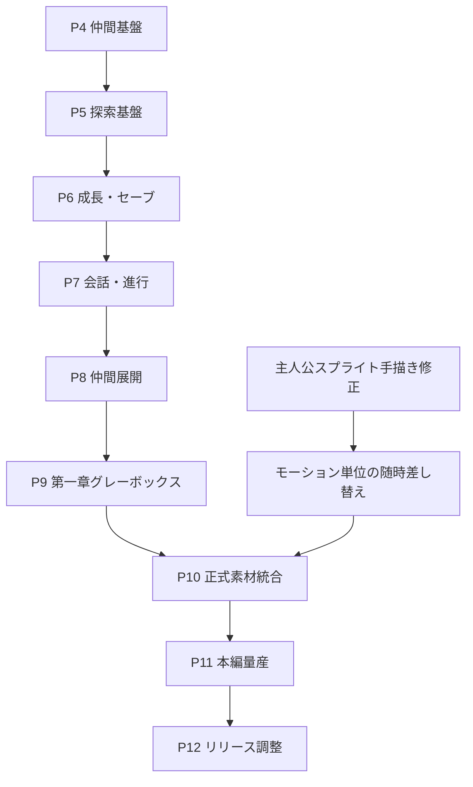

# 桃太郎プロジェクト 改訂ロードマップ v2.0

作成日：2026-09-05  
対象環境：Unity 6000.3.20f1／URP／Orthographic Camera  
目的：主人公スプライトの手描き修正を待たず、仮素材で検証できる実装を先行する。

---

## 1. 改訂方針

主人公スプライトの手描き修正を、ゲーム全体のクリティカルパスから外す。

今後は次の2レーンを並行して進める。

1. **ゲーム実装レーン**：仮スプライト、単色シルエット、既存素材を使い、ロジック・Data・Scene・テスト・Validatorを先行する。
2. **アート制作レーン**：主人公の正式スプライトを手描きで修正し、完成したモーション群から段階的に差し替える。

両レーンはPhase 10「正式素材統合・演出固定」で完全に合流する。正式素材が早く完成した場合は、Phase 10を待たず、モーション単位で随時取り込んでよい。

### 1.1 守るべき原則

- Gameplayロジックを画像サイズ、フレーム数、fps、AnimationClip名へ依存させない。
- 当たり判定、接地点、攻撃原点、向きはTransform／Data／明示的なアンカーを正本とする。
- 仮素材の見た目を前提に戦闘数値やカメラを最終決定しない。
- 正式素材への差し替えだけでGameplayの再実装が発生しない構造を維持する。
- 素材未割当時は、既存方針どおり無音／非表示・無例外で継続する。
- 既存の192×192、PPU100、Pivot bottom-center `(0.5, 0)`、接地点下端+4pxを主人公の受入基準として維持する。
- Unityでの人間確認は各Phaseの統合ゲートへ集約する。

---

## 2. 現在地

| Phase | 状態 | 到達内容 |
|---|---|---|
| P0 | 完了 | プロジェクト基盤、規約、検証基盤 |
| P1 | 完了 | 主人公移動・入力・Data基盤 |
| P2 | 完了 | 主人公戦闘アクション |
| P3 | 完了 | 敵AI・敵戦闘・敵3種 |
| P3.5 | 完了・main統合済み | 4 Wave戦闘試遊版、勝敗、Retry、HUD、VFX／SE、Validator |
| P4-00 | 実装済み・レビュー修正確認中 | 徳の保持・撃破報酬の受け手・役割別Reward |
| 主人公正式スプライト | 並行作業中 | AI生成素材を手描きで正本化 |

---

## 3. 新しい全体工程

| Phase | 主題 | 仮素材で進行 | 正式主人公素材への依存 |
|---|---|---:|---:|
| P4 | 犬丸・仲間共通基盤 | 可能 | なし |
| P5 | マップ・探索基盤 | 可能 | なし |
| P6 | アイテム・徳・成長・セーブ基盤 | 可能 | なし |
| P7 | 会話・イベント・章進行基盤 | 可能 | なし |
| P8 | 仲間切替・猿・雉への展開 | 可能 | なし |
| P9 | 第一章グレーボックス縦切り | 可能 | なし。ただし視覚品質は評価しない |
| P10 | 正式素材統合・演出固定 | 一部不可 | **ここで必須** |
| P11 | 本編コンテンツ量産 | 一部可能 | 原則、統合後 |
| P12 | Alpha／Beta／リリース調整 | 不可 | 必須 |

### 並行関係

---

## 4. Phase別ロードマップ

## P4：犬丸・仲間共通基盤

### 目的

最初の仲間「犬丸」を、仮表示のままでも追従・戦闘・防御・探索まで試せる状態にする。同時に、後続の猿・雉が再利用できる仲間共通契約を確立する。

### タスク案

| ID | 内容 | 素材依存 |
|---|---|---|
| P4-00 | 徳・撃破報酬の受け手 | なし。実装済み、指摘修正後に確定 |
| P4-01 | `CompanionData`、仲間状態、所属・対象契約 | なし |
| P4-02 | 犬丸の追従、隊列、距離超過／経路失敗ワープ | Idle代替で可 |
| P4-03 | 犬丸の戦闘参加、索敵、対象選択、通常攻撃 | 仮4方向表示で可 |
| P4-04 | ガード／回避判断、被弾解決 | 色替え・アイコンで可 |
| P4-05 | 守護、「かばう」の割込み条件とクールダウン | 仮VFXで可 |
| P4-06 | Hurt／Down／復帰、退場時の後始末 | 静止画で可 |
| P4-07 | 探索行動、プレイヤー指示との優先順位 | Idle代替で可 |
| P4-08 | 犬丸用テストScene、Builder、Validator、統合受入 | 仮素材で可 |

### P4で行わないもの

- 犬・猿・雉の一括完成
- 犬丸の完成スプライト、完成VFX／SE
- 完成版メニュー、会話、宝箱、セーブ
- 正式マップ上での演出調整

### P4終了条件

- 犬丸が既存の敵AI・命中解決・ヘイト契約へ接続されている。
- 追従、ワープ、戦闘、ガード／回避、かばう、Down／復帰、探索行動が仮表示で識別できる。
- Disable、Scene離脱、Retryで購読・攻撃判定・対象・Coroutineが残らない。
- EditMode／PlayModeテスト、Data検証、専用Validatorが成功する。

---

## P5：マップ・探索基盤

### 目的

完成マップ素材を使わず、グレーボックスで「歩く・調べる・移動する・戦闘へ入る・戻る」を成立させる。

### 主な内容

- Tilemapまたは単色ブロックによるフィールド試作
- 壁、段差、水場、通行可能領域、FloorIdの契約
- カメラ追従、部屋境界、必要ならカメラ制限
- Scene／エリア遷移、入口と復帰地点
- `Interact`入力、調査対象、扉、簡易レバー
- Encounter Triggerと戦闘開始／終了後の復帰
- 仲間の経路失敗検知、ワープ、エリア遷移追従
- 探索Scene Builder／Validator

### 終了条件

仮マップ上で「探索開始 → 調査 → エリア移動 → 遭遇戦 → 探索復帰」を一周できる。

---

## P6：アイテム・徳・成長・セーブ基盤

### 目的

P4-00の徳を戦闘試遊専用状態から本編進行へ接続し、保存可能なプレイヤー進行データを確立する。

### 主な内容

- 最小インベントリと`ItemId`の実付与
- 金丹等の消費アイテム、`UseKintan`入力
- 徳のHUD表示と獲得通知
- `SkillNodeData`を利用した最小成長ループ
- Runtime Snapshotと保存Dataの分離
- Save／Load、バージョン、欠損・旧版フォールバック
- Retryでリセットする戦闘セッション値と、保存する本編値の明確化

### 終了条件

戦闘報酬を獲得し、成長またはアイテム消費へ使い、Scene移動・ゲーム再起動後も指定値だけ復元できる。

---

## P7：会話・イベント・章進行基盤

### 目的

完成NPC素材や本編シナリオ全文を待たず、条件分岐可能な物語進行の器を作る。

### 主な内容

- NPC／調査対象との会話開始・終了
- Dialogue Data、話者、行、選択肢の最小構造
- 条件判定と進行フラグ
- Event Sequence（会話、移動、戦闘、報酬、Scene遷移）
- 仲間加入イベント
- 章／クエスト状態
- スキップ、中断、再開時の安全な状態
- 仮UIによる会話・選択肢表示

### 終了条件

「NPCと会話 → 条件分岐 → 戦闘 → 報酬 → 仲間加入または章更新」を仮表示で実行できる。

---

## P8：仲間切替・猿・雉への展開

### 目的

P4で確立した犬丸の実装を共通化し、3仲間の役割差と切替を成立させる。

### 主な内容

- `SwitchCompanion`入力と切替クールダウン
- 登場／退場、Down、復帰、Scene遷移時の状態管理
- 猿：機動・妨害等の役割実装
- 雉：遠距離・偵察等の役割実装
- 犬丸を含む3仲間のヘイト倍率と戦闘役割の調整
- 仲間スキル入力と共通クールダウン表示
- 仮スプライトによる3者の明確な識別

### 終了条件

3仲間を切り替え、それぞれの戦闘・探索上の役割差を仮素材でも判断できる。

---

## P9：第一章グレーボックス縦切り

### 目的

正式素材なしで、本編の制作パイプラインとゲームループそのものを検証する。

### 主な内容

- 第一章相当の仮マップ構成
- 拠点、探索エリア、戦闘Encounter、章ボスの仮実装
- NPC、会話、イベント、仲間加入、報酬、成長
- タイトル／開始／セーブ／ロード／章クリアの一連化
- 第一章用Builder／Validatorまたは静的検証ツール
- 試遊手順書とフィードバック票

### 評価対象

- 導線、理解可能性、ゲームテンポ、戦闘と探索の比率
- 仲間の有用性、進行・報酬・成長の循環
- Scene遷移、保存、再開、後始末の安定性

### 評価しないもの

- 主人公の作画品質
- 完成マップの美術品質
- 最終VFX／SE／BGM
- アニメーションの細かな間、武器位置、カメラの最終調整

---

## P10：正式素材統合・演出固定

### 目的

並行制作した主人公スプライトを正本として統合し、見た目に依存する調整を初めて確定する。

### 主な内容

- 主人公の全モーション差し替え
- 方向、接地、全高、身体比率、刀・鞘、前後関係の全フレーム検査
- AnimationClip／Animator配線の再生成または更新
- 攻撃判定と剣閃VFXの見た目上の一致
- 武器・手・足のアンカー調整
- カメラサイズ、揺れ、ヒットストップ、移動速度の視覚調整
- 犬丸ほか、その時点で完成している仲間素材の統合
- マップ、UI、VFX、SEの第一章向け品質固定
- 旧仮素材の参照残りをValidatorで検出

### 終了条件

P9の縦切りを正式主人公素材で最後まで遊べ、仮素材参照、負スケール、接地ずれ、方向誤り、Missing Scriptがない。

---

## P11：本編コンテンツ量産

### 目的

P9で確認したパイプラインとP10で固定した表現基準を使い、本編を章単位で増やす。

### 主な内容

- 本編マップ、NPC、会話、イベントの量産
- 敵種、強敵、ボス、Encounterの追加
- 宝箱、収集物、徳・アイテム・成長配置
- 仲間固有イベントと探索能力
- 章ごとの自動検証、通しプレイ記録

章ごとに「グレーボックス → ロジック受入 → 素材統合 → 演出調整 → 章受入」の小さな縦切りを繰り返す。

---

## P12：Alpha／Beta／リリース調整

### 主な内容

- 全章通し、進行不能、保存互換、入力機器の検証
- 難易度、経済、成長速度、仲間バランス
- UI／UX、アクセシビリティ、解像度、音量
- パフォーマンス、ロード時間、メモリ、ビルド検証
- 不要なDebug／仮素材／テスト専用参照の除去
- 配布ビルド、既知問題一覧、リリース候補受入

---

## 5. 主人公スプライト並行レーン

| Art Gate | 内容 | 完了時の処理 |
|---|---|---|
| A1 | Idle 4方向を正本化 | 身体比率、配色、接地、刀・鞘を基準固定 |
| A2 | Move 4方向 | 仮Moveのみ差し替え、移動ロジックは変更しない |
| A3 | Attack1〜3、Guard、Step | Clip単位で差し替え、判定・VFXは目視再確認 |
| A4 | Hurt、GuardBreak、Special Charge／Attack | リアクション・必殺の表示を差し替え |
| A5 | 全方向・全フレームQA | ノイズ、形状破綻、前後関係、接地、縮尺を総点検 |

### 各Art Gateの受入条件

- キャンバス、PPU、Pivot、接地点が基準どおり。
- 透明背景に不要な色・ノイズがない。
- 方向別に頭部、胴体、手足、刀、鞘の一貫性がある。
- 前後関係と攻撃軌道が意図どおり。
- 差し替えでGameplayテスト結果が変化しない。

---

## 6. 先行可能・保留すべき作業

### 今すぐ先行できる

- 仲間Data、状態機械、AI、ヘイト、追従、ワープ
- 仲間の攻撃・防御・Down・復帰・切替ロジック
- 徳、アイテム、成長、Save／Load
- グレーボックスマップ、Scene遷移、Encounter
- 会話・イベント・章進行のDataとランナー
- Builder、Validator、EditMode／PlayModeテスト
- シナリオ、マップ構成、敵・報酬配置の設計

### 正式素材まで最終確定しない

- 攻撃VFXのピクセル単位の位置
- 手・刀・鞘へ追従するエフェクトアンカー
- アニメーション速度の最終値
- カメラサイズと揺れの最終値
- キャラクター間の見た目上の距離・重なり
- 最終的な当たり判定の微調整
- 完成版UIの余白・顔アイコン寸法

---

## 7. 共通受入ゲート

各タスク・Phaseは、原則として次を満たしてから受け入れる。

1. Compile Error 0、Console Error 0。
2. 既存EditMode／PlayModeテストが全成功。
3. 新規純粋ロジックはEditMode、実行時ライフサイクルはPlayModeで検証。
4. DataはSnapshot化し、実行中にScriptableObject原本を書き換えない。
5. Scene再読込、Disable、遷移後に購読・Coroutine・Hitbox・Projectile・対象参照が残らない。
6. Builderで再生成しても必要配線が復元される。
7. Validatorが単一性、必須参照、Missing Script、仮素材残り等を検査する。
8. 人間によるUnity確認は、そのPhase固有の体感・視認性だけに限定する。

---

## 8. 直近の推奨順序

1. P4-00のレビュー指摘を反映し、徳94・Retryリセット・撃破イベント順を確定する。
2. P4-01で仲間共通契約と`CompanionData`の不足アクセサを確定する。
3. P4-02で犬丸を仮表示し、追従・ワープだけを先に通す。
4. P4-03〜P4-07を小分けに実装する。
5. P4-08で犬丸グレーボックス試遊版を受け入れる。
6. 主人公スプライトはA1〜A5を並行し、完成した単位から安全に差し替える。

この順序なら、主人公の手描き修正が長期化してもP9までは原則停止せずに進行できる。正式スプライトの完成はP10の開始条件ではなく、**P10の終了条件**として管理する。
